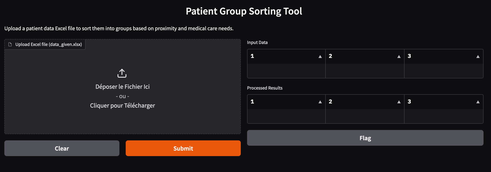

# Patient-Clustering-and-Software
This tool provides a user-friendly interface for sorting patients into groups based on proximity and medical care needs.

### Features:
- Upload Excel files containing patient data
- View input data and processed results side by side
- Automatic sorting based on geographical proximity
- Clear visualization of patient groupings
